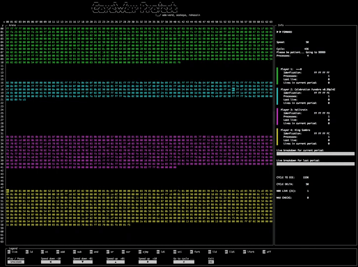
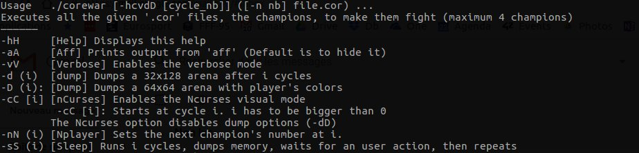
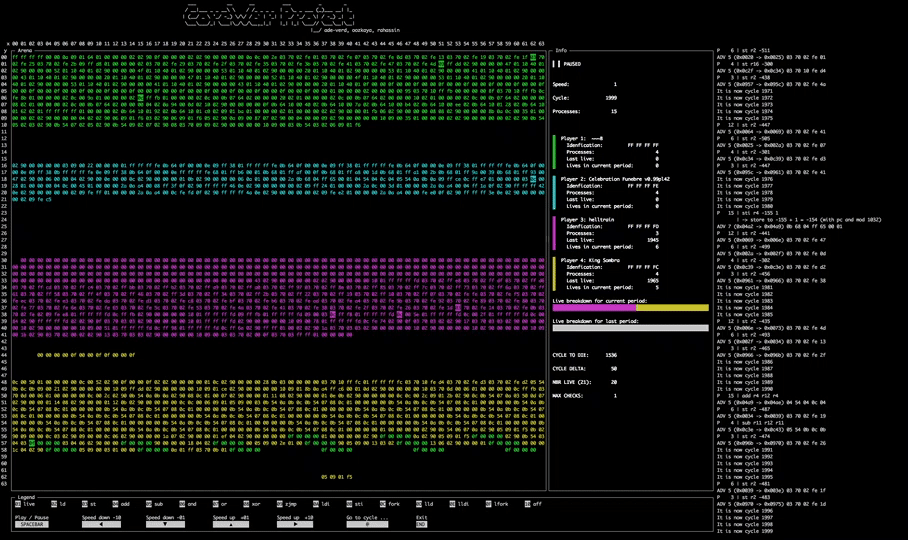
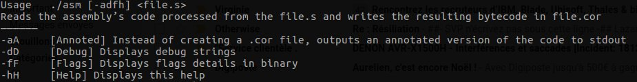

Corewar
======

About
-----

>Core War is a 1984 programming game created by D. G. Jones and A. K. Dewdney in which two or more battle programs (called "warriors") compete for control of a virtual computer.
These battle programs are written in an abstract assembly language called Redcode.

42 Version
----------

Here's how it looks like:

We don't use the same set of assembly instructions as the original Corewar and we have some modulo limitations for the read and write ranges.

Subjects: [corewar.fr.pdf](subject/corewar.fr.pdf) or [corewar.en.pdf](subject/corewar.en.pdf)

##### How to use it ?

* First you'll need to write a .s file with a set of assembly instructions
    * You can create your own champion with [this set below](#assembler-instructions)
    * Or you can just use one of the many warriors in the resources/champs directory
* Then you'll have to compile it using the `asm` binary
* Then just execute the `corewar` binary with your warrior(s) as arguments

>This was the final project of the Algorithm branch.

## Assembler instructions
--------

| OP | Effects | Charge | Changes the `carry` ? | Octal Coding | `DIR` Bytes |
|:-: | ------- | :----------------: | :--------------------: | :----------: | :----------------: |
| **`live`**  `DIR` | `live` is followed by 4 bytes which represents the player's number as unsigned int. This instruction means the player is alive. | 10 | No | No | 4 |
| **`ld`**  `DIR`&#124;`IND`, `REG` | Loads a value from an address into a register.  *Example: `ld 34,r3` stores `REG_SIZE` octets from 34 bytes after the current address (`PC + (34 % IDX_MOD)`) into the register `r3`.*| 5 | Yes | Yes | 4 |
| **`st`**  `REG`, `IND`&#124;`REG` | Stores the value of a register to an address or into an other register.  *Example1: `st r4,34` stores the value of `r4` to the address `(PC + (34 % IDX_MOD))`* *Example2: `st r3,r8` copies `r3` into `r8`* | 5 | No | Yes | - |
| **`add`**  `REG`, `REG`, `REG` | The third parameter is the result of the addition of the first two.  *Example: `add r2,r3,r5` sums `r2` and `r3` and stores the result into `r5`* | 10 | Yes | Yes | - |
| **`sub`**  `REG`, `REG`, `REG` | Like `add` with a substraction. | 10 | Yes | Yes | - |
| **`and`**  `REG`&#124;`DIR`&#124;`IND`, `REG`&#124;`DIR`&#124;`IND`, `REG` | Applies a binary AND '&#124;' to the first two parameters. Then stores the result into a register.  *Example: `and r2,%0,r3` stores the result of `r2 & %0` into `r3`* | 6 | Yes | Yes | 4 |
| **`or`**  `REG`&#124;`DIR`&#124;`IND`, `REG`&#124;`DIR`&#124;`IND`, `REG` | Like `and` with a binary OR '&#124;'. | 6 | Yes | Yes | 4 |
| **`xor`**  `REG`&#124;`DIR`&#124;`IND`, `REG`&#124;`DIR`&#124;`IND`, `REG` | Like `and` with a binary EXCLUSIVE OR '^'. | 6 | Yes | Yes | 4 |
| **`zjmp`**  `DIR` | Takes an index and makes a jump to this index if the carry is set to 1. If the carry is null, `zjmp` does nothing but consumes the same amount of time.  *Example: `zjmp %23` (with carry == 1) PC becames `(PC + (23 % IDX_MOD))`* | 20 | No | No | 2 |
| **`ldi`**  `REG`&#124;`DIR`&#124;`IND`, `REG`&#124;`DIR`, `REG` | Cette opération modifie le carry. `ldi 3,%4,r1` lit `IND_SIZE` octets à l’adresse : `(PC + (3 % IDX_MOD))` ajoute 4 à cette valeur. On nommera S cette somme. On lit `REG_SIZE` octets a l’adresse `(PC + (S % IDX_MOD))` qu’on copie dans r1. Les paramètre 1 et 2 sont des index.| 25 | No | Yes | 2 |
| **`sti`**  `REG`, `REG`&#124;`DIR`&#124;`IND`, `REG`&#124;`DIR` |`sti r2,%4,%5` sti copie `REG_SIZE` octets de r2 a l’adresse `(4 + 5)`. Les paramètres 2 et 3 sont des index. Si les paramètres 2 ou 3 sont des registres, on utilisera leur contenu comme un index.| 25 | No | Yes | 2 |
| **`fork`**  `DIR` | Cette instruction n’est pas suivie d’octet pour décrire les paramètres. Elle prend toujours un index et crée un nouveau programme qui s’exécute a partir de l’adresse:`(PC + (premier paramètre % IDX_MOD))` `fork %34` crée un nouveau programme. Le nouveau programme hérite des différents états du père.| 800 | No | No | 2 |
| **`lld`**  `DIR`&#124;`IND`, `REG` | Comme ld sans le `%IDX_MOD` Cette opération modifie le carry.| 10 | Yes | Yes | 4 |
| **`lldi`**  `REG`&#124;`DIR`&#124;`IND`, `REG`&#124;`DIR`, `REG` | Comme ldi sans le `%IDX_MOD` Cette opération modifie le carry.| 50 | Yes | Yes | 2 |
| **`lfork`**  `DIR` | Comme fork sans le `%IDX_MOD` Cette opération modifie le carry.| 1000 | No | No | 2 |
| **`aff`**  `REG` | Cette instruction est suivi d’un octet de paramétrage pour décrire les paramètres. Elle prend en paramètre un registre et affiche le caractère dont le code ascii est présent dans ce registre. (un modulo 256 est applique au code ascii, le caractère est affiché sur la sortie standard). Ex :` ld %42,r3` puis `aff r3` affiche ’*’ sur la sortie standard. | 2 | No | Yes | - |

Nota:
* `DIR`: Direct type: Number as unsigned int (4 bytes) or adress as unsigned short (2 bytes)
* `IND`: Indirect type: Relative address
* `REG`: Register type: Register which stores a numeric value

## Set up
------------

Just run `make`... then enjoy!

Works on OS X and Linux Debian / Ubuntu. The `nCurses` library is used for the viewer.

## Usage
-----

#### corewar - Virtual Machine
`./corewar [-hcvdD [cycle nb]] ([-n nb] file.cor) ...`

You can combine some flags. For example the flags -c (nCurses) and -v (Verbose)

##### Keys
* <kbd>spacebar</kbd> Play / Pause
* <kbd>▲</kbd> or <kbd>▶</kbd> Speed up (respectively +1 or +10)
* <kbd>▼</kbd> or <kbd>◀</kbd> Speed down (respectively -1 or -10)
* <kbd>@</kbd> Go to cycle ... Then an integer superior than the current cycle is expected. Validate with <kbd>Enter</kbd>
* <kbd>end</kbd> Quit properly the program

#### asm - Assembler
`./asm [-adfh] file.s`

#### rasm - Disassembler
`./rasm file.cor ...`

